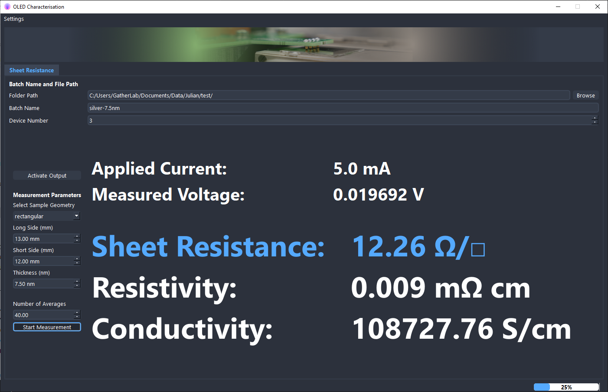

<h1 align="center">
  GatherLab - Four Point Probe Sheet Resistance Measurement Software
</h1>

<p align="center">
  <a href="#setup">Setup</a> •
  <a href="#hardware">Hardware</a>•
  <a href="#user\ journey">User Journey</a>
</p>

Easy-to-use, affordable four point probe design, reported in <DOI>. This
repository provides the open-source software that allows for the direct
conversion to sheet, resistance, resistivity, and conductivity.

## Setup

### Hardware

The software can be easily adapted for other (cheaper) equipment, but we used
the following current source/multimeters.

| Item                | Brand    | Model Number               |
| ------------------- | -------- | -------------------------- |
| Keithley Source     | Keithley | Sourcemeter, Keithley 2450 |
| Keithley Multimeter | Keithley | Multimeter, Keithley 2100  |

### First Setup

Setup a python environment with your favourite virtual environment management
tool. The following step by step guide assumes that the user wants to use the
since python 3.3 recommended software venv that ships with python on a windows
machine.

1. Clone project folder to your local machine
2. Change e.g. with windows power shell into the project folder
3. Generate a virtual environement with the name "venv"

```terminal
py -m venv venv
```

4. Activate the new environement

```
Set-ExecutionPolicy Unrestricted -Scope Process
.\venv\Scripts\activate
```

5. Install required packages from requirements.txt (this assumes that pip is activated on your machine)

```
pip install -r requirements.txt
```

6. Install Keithley drivers from website: https://de.tek.com/source-measure-units/2450-software-6 (prerequisit: NI-visa)
7. On the Keithley source meter (for specs see below) the command set on the Keithley has to be changed to SCPI
8. Execute the main.py file to start the program

```terminal
python3 main.py
```

## Graphic User Interface



## Development

Bug reports and pull requests are highly welcome.
